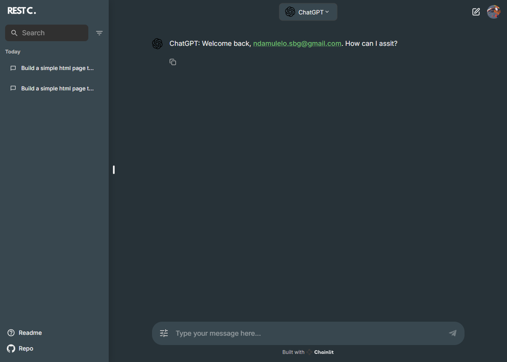

# REST Chat  - Research Demo

> Welcome to **REST Chat**, an open-source, research-focused chat application that allows users to integrate their own API keys to interact with **state-of-the-art AI models**.  Released under **Rihone AI Labs**, for quick prototyping and experimentation with AI Chat applications.

[](./LICENSE)

[Live Demo](https://restchat-production.up.railway.app/)

[Deploy To Azure]()

[Deploy To AWS]()



## Features

- Integration with top 5 AI model providers, inlcuding:
   - [ x ] [OpenAI](https://openai.com/) / [Azure OpenAI](https://learn.microsoft.com/en-us/azure/ai-services/openai/overview)
   - [ x ] [Anthropic](https://www.anthropic.com/)
   - [ x ] [Google AI](https://www.gemini.com/)
   - [   ] [AWS Bedrock](https://www.gemini.com/)
   - [   ] [Huggingface](https://www.gemini.com/)
- Support multiple chat profiles including
   - [ x ] LLM Chat
   - [ x ] Text to Image
   - [ ] Multimodal Chat (`WIP`)
   - [ ] Voice Chat (`WIP`)
   - [ ] [Experimental] Text to Media - Music or Video (`WIP`)
- Chainlit Chat settings
- Chainlit Authentication
- Chainlit Custom logo and favicon
- Chainlit Custom theme

## Running Locally

### Installation

1. Clone the repository:

   ```bash
   git clone https://github.com/rihoneailabs/restchat.git
   cd restchat
   ```

2. Create a python virtual environment:

   ```bash
   python -m venv venv         # We assume you are using at least Python 3.11
   source venv/bin/activate    # For Unix-based systems i.e. MacOS, Ubuntu etc.
   venv\Scripts\activate.bat   # For Windows
   ```

3. Install python dependencies:

   ```bash
   pip install -r requirements.txt
   pip install -U --prefer-binary tokenizers anthropic

   # Tip: If you have poetry installed, use it instead:
   # poetry install
   ```

> **Hint:** If you encounter an error when installing `tokenizers` which is a sub-depenency of the `anthropic` package, you will need to 
explictly tell `pip` to install a pre-build binary instead of building from source: `pip install -U --prefer-binary tokenizers anthropic`


### Configuration

1. Rename the provided `.env.example` file into `.env` in the project root directory.

2. Modify the `.env` file by setting the required configuration variables as follows:

   ```bash
   CHAINLIT_AUTH_SECRET=your_64_char_secret_for_signing_auth_tokens
   LITERAL_API_KEY=your_literal_api_key_for_storing_chat_history
   
   # Optional: At least one of the following chat providers is required
   OPENAI_API_KEY=your_openai_api_key
   ANTHROPIC_API_KEY=your_anthropic_api_key
   GOOGLE_API_KEY=your_google_api_key
   
   # Optional
   DEFAULT_USERNAME=your_default_username  # Default: "admin"
   DEFAULT_USER_PASSWORD=your_default_user_password

   # Recommended: OAuth settings (see https://docs.chainlit.io/authentication/oauth)
   OAUTH_GOOGLE_CLIENT_ID=your_google_client_id
   OAUTH_GOOGLE_CLIENT_SECRET=your_google_client_secret
   ```

    > **Hints:** You can generate a 64-character secret key using the following command: `chainlit create-secret`. To
    > obtain an API key for [Literal](https://literal.chainlit.com), sign up for an account and create a new project.

### Run web app

To run the Chainlit app, use the following command:

```bash
chainlit run app.py --host 0.0.0.0 --port 5500
```

* You app should now be accessible at `http://localhost:5500`

## Project Structure

The project structure is organized as follows:

- `.chainlit/`: Contains the Chainlit configuration files.
- `restchat/`: Contains the core application code.
- `public/`: Contains the static files for custom logos and favicons.
- `app.py`: The main application entry point.
- `requirements.txt`: Lists the project dependencies.
- `.env.example`: Stores the environment variables template.

## Issues

- Bugs and issues can be reported on the [GitHub Issues](https://github.com/rihoneailabs/restchat/issues) page.

## License

This project is licensed under the Apache 2.0 License. See [License](./LICENSE) for more details.

---

## Contributions

We welcome contributions from the community to help improve **REST Chat**! Here’s how you can contribute:

1. **Fork the repository**.
2. **Create a feature branch**: `git checkout -b feature/new-feature`.
3. **Commit your changes**: `git commit -m 'Add some feature'`.
4. **Push to the branch**: `git push origin feature/new-feature`.
5. **Open a pull request**.

---

## 🌐 Roadmap

This is an early-stage research version. Here’s what we plan to explore in future versions:

- [ ] Azure Click to Deploy
- [ ] AWS Click to Deploy
- [ ] Multimodal Chat (`WIP`)
- [ ] Voice Chat (`WIP`)
- [ ] [vLLM](https://arxiv.org/abs/2109.03828) intergration
- [ ] [Experimental] Text to Media - Music or Video (`WIP`)
- [ ] Multi-lingual support

---

## 🙌 Acknowledgments

Special thanks to everyone who contributes to **REST Chat** and helps push forward research and experimentation in accesible chat applications.

* [Chainlit](https://github.com/Chainlit/chainlit)
* [Literal API](https://cloud.getliteral.ai/)
